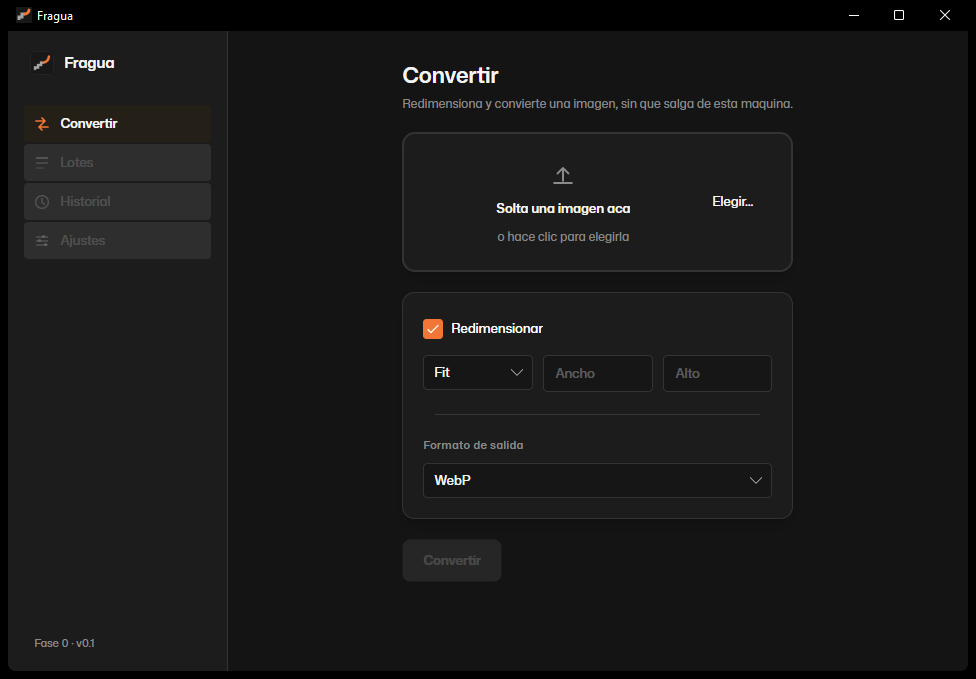

# Fragua

Herramienta de escritorio para preparar imágenes sin que salgan de la máquina: convertir formato y redimensionar en una sola pasada, con inferencia local para las fases siguientes.



## Por qué existe

Hay dos tipos de conversores de imágenes dando vueltas: sitios web que piden subir los archivos a un servidor ajeno, y freeware de Windows de hace quince años lleno de publicidad. Fragua hace el trabajo completo de preparar imágenes para publicar sin que ningún archivo salga de la máquina, incluida la parte de inteligencia artificial que llega en fases posteriores (quitado de fondo con un modelo ONNX local, no una API).

**No es un editor.** No hay capas, ni pinceles, ni retoque manual. No tiene cuentas ni nube: sin login, sin sincronización, sin telemetría.

## Estado

Fase 0: convertir y redimensionar. Publicable y ya útil por sí sola. El plan completo (producto, marca, sistema de diseño, stack, arquitectura y hoja de ruta) está documentado en detalle antes de escribir una línea de código.

## Stack

| Capa | Tecnología | Licencia |
|---|---|---|
| Interfaz | Avalonia UI 11 sobre .NET 10, patrón MVVM | MIT |
| Procesamiento de imagen | Magick.NET | Apache 2.0 |
| MVVM | CommunityToolkit.Mvvm | MIT |
| Tests | xUnit | Apache 2.0 |

Multiplataforma real: mismo código en Windows, Linux y macOS, sin capas de compatibilidad.

## Arquitectura

```
Fragua.sln
├── Fragua.Core/       Dominio puro: pipeline, operaciones, contratos.
│                       No conoce Avalonia ni Magick.NET.
├── Fragua.Imaging/    Implementaciones reales: Magick.NET.
├── Fragua.App/        Avalonia: vistas, viewmodels, sistema de diseño.
└── Fragua.Tests/       xUnit sobre Core e Imaging, unitario e integración.
```

`Fragua.Core` no conoce ni la interfaz ni la librería de imágenes: define el pipeline y sus contratos en C# puro. Eso permite testear el motor entero sin levantar ventana ni decodificar una imagen real (`ImagePipelineTests` usa operaciones falsas para probar orden, cancelación y manejo de errores); los tests de integración corren contra imágenes generadas en runtime, sin binarios commiteados al repositorio.

El pipeline es componible: `CancellationToken` atraviesa todo (un lote se puede cortar a mitad de camino), el progreso reportado es real (archivo y paso actual, no una barra que avanza sola), y un error en un archivo no corta el resto del lote.

## Sistema de diseño

Grises acromáticos puros (croma 0 en OKLCH): la interfaz de una herramienta de imagen no puede competir con la imagen que muestra. El único color de toda la app es el acento brasa (`#F27636`), reservado para la acción principal, la selección activa y el progreso.

Tipografía: Mona Sans (GitHub, OFL) para interfaz, Commit Mono (OFL) para cifras — dimensiones, pesos, porcentajes, siempre alineados en una fuente monoespaciada.

## Correr en desarrollo

Requiere el SDK de .NET 10.

```bash
dotnet restore
dotnet build
dotnet run --project src/Fragua.App
```

## Tests

```bash
dotnet test
```

12 tests: pipeline unitario con operaciones falsas (orden, cancelación, errores, paralelismo de lotes) e integración real con Magick.NET (carga, redimensión exacta y proporcional, conversión de formato, peso de salida).

## Hoja de ruta

| Fase | Contenido |
|---|---|
| **0** | Convertir y redimensionar (actual) |
| 1 | Lotes, optimización, ajustes predefinidos, historial |
| 2 | Quitar fondo con ONNX local (`silueta`) |
| 3 | Vectorizar (ImageTracer.NET) |
| 4 | Empaquetado Linux y macOS |

## Licencia

MIT. Ver [LICENSE](LICENSE).

---

<div align="center">
<sub>Diseñado y desarrollado por <a href="https://github.com/Ferchulobo777">Fernando Rodríguez</a> · 2026</sub>
</div>
